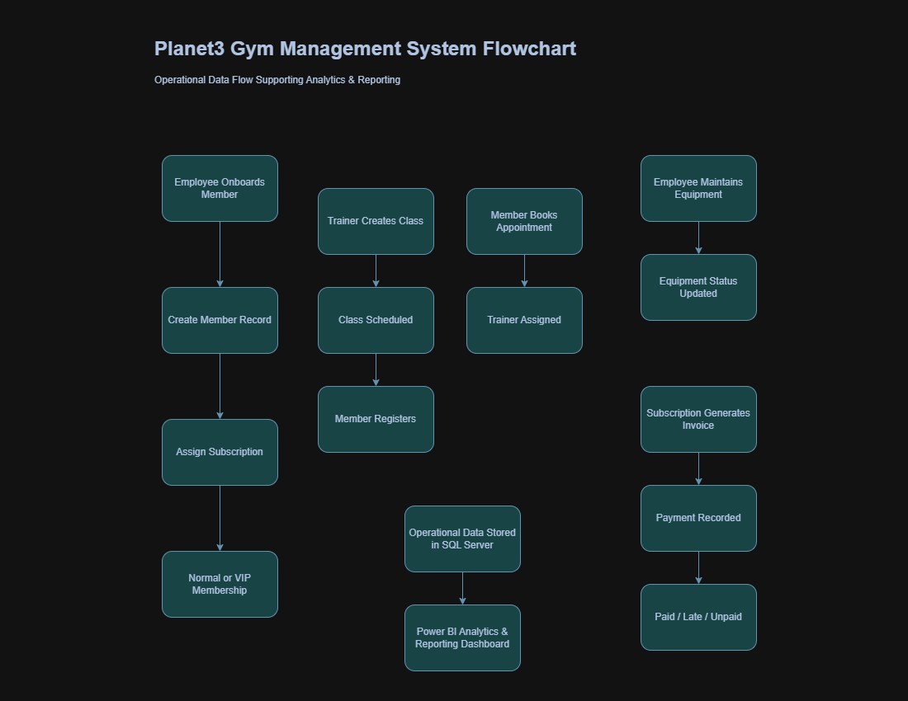
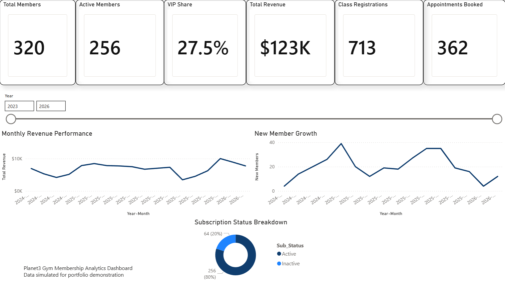
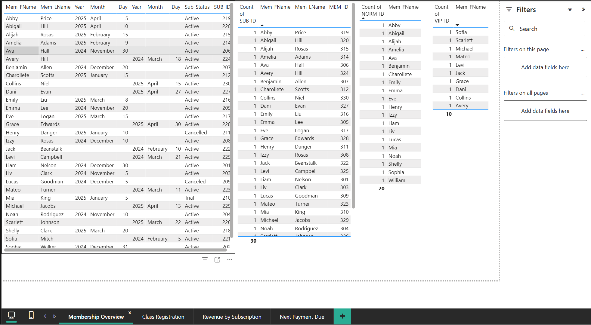
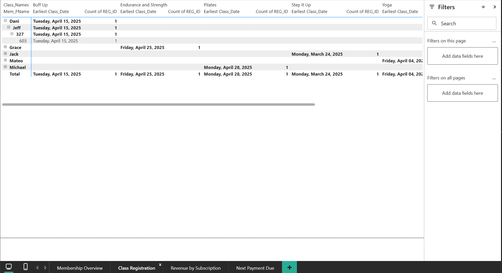
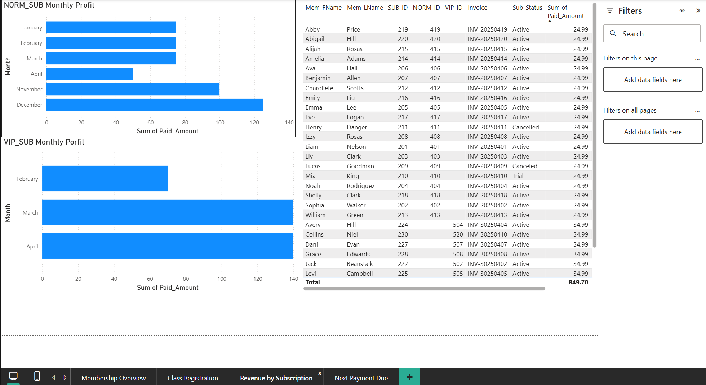
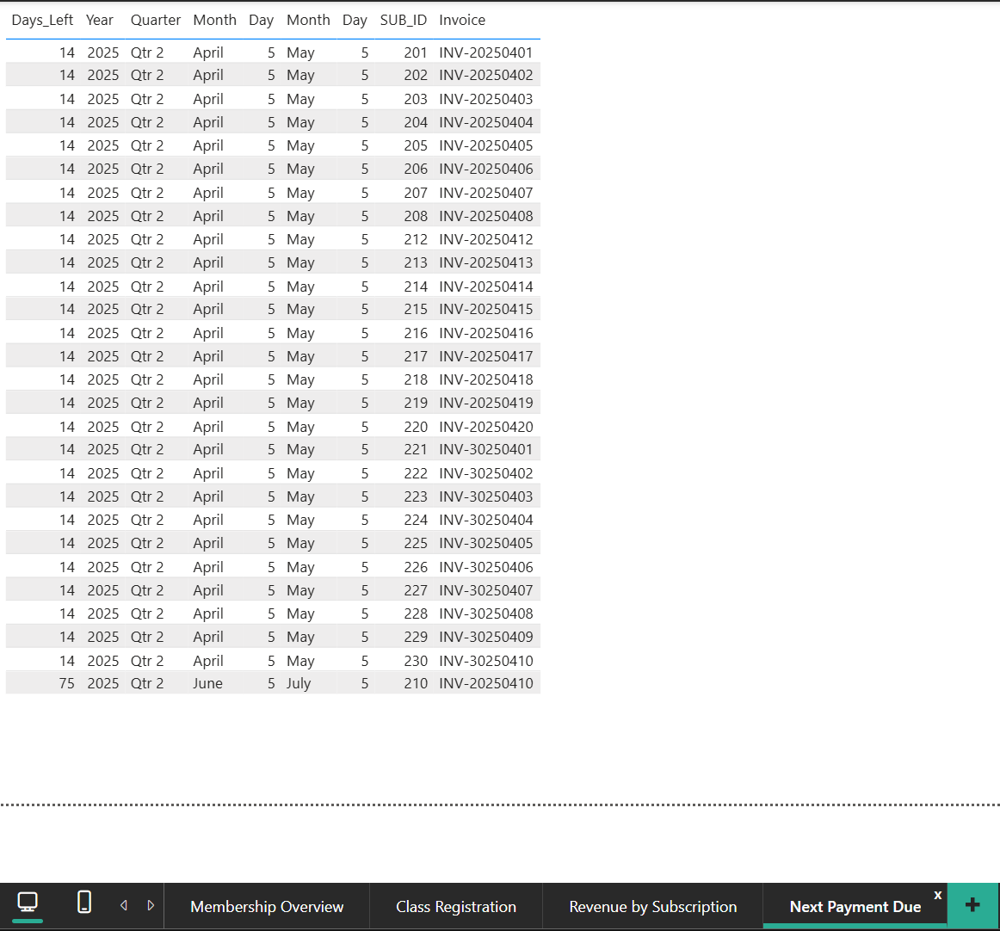

# Planet 3 Gym Membership & Analytics System

## Overview
Planet 3 is a small local gym that previously managed memberships, payments, and class bookings using paper based processes. The objective of this was to design and implement a modern information systems that digitalizes operations and enables business analytics.

This project demonstrates database deisgn, business systems analysis, and data visulaization using SQL Server and Power BI.

---

## Business Problem
The gym relied on manual record keeping for:
- Membership management
- Class scheduling
- Trainer assigments
- Subscription payments
- Equipment maintenance tracking

Manual processes limited operational efficienct and prevented data-driven decision making.

---

## Solution
Designed and implemented a realtional database system that:
- Centralizes membership and subscription data
- Tracks payments and booking activity
- Support trainer and class management
- Enables reporting and business insights through Power BI dashboards

---

## My Role
- Database development
- Report creation and analytics design
- Data modeling implementation
- Power BI dashboard development

----

#System Features
- Relational Database Design
- Business Rules Modeling
- Entity Relationship Diagram (ERD)
- Workflow & Process Design
- Store Procedures for payment tracking
- Analytics dashboard for operational insights

### Business Process Flow

### Entity Relationship Diagram (ERD)

---

## Technologies Used
- SQL Serve (SSMS)
- Power BI
- Data Modeling & Normalization
- Business Ssytem Analysis
- Database Design

---

## How to Run Locally (SQL Server/ SSMS)
1. Create a new database in SSMS (ex. 'planet3_gym_management').
2. Run 'sql/01_create_tables.sql'
3. Run 'sql/02_insert_data.sql'
4. Run 'sql/03_stored_procedures.sql'

To test the stored procedure:
'''sql
EXEC dbo.DaysUntilNextPayment;

## Dashboard Preivew
###

### Membership Overview

### Class Registration

### Revenue by Subscription

### Next Payment Due

---

## Documentation

- Original Project Proposal: `docs/project_proposal_original.pdf`

---

## Project Context
Orginally developed as a collaborative group system analysis project.

Portfolio version maintined and enhanced by Sahvaan Price, including:
- Database implementation
- SQL developemtn
- Power BI Analytics dashboard
- System refinements and documentation improvements

## Author
Sahvaan Price
Information Systems | Data Analysis | Business Systems Analysis
